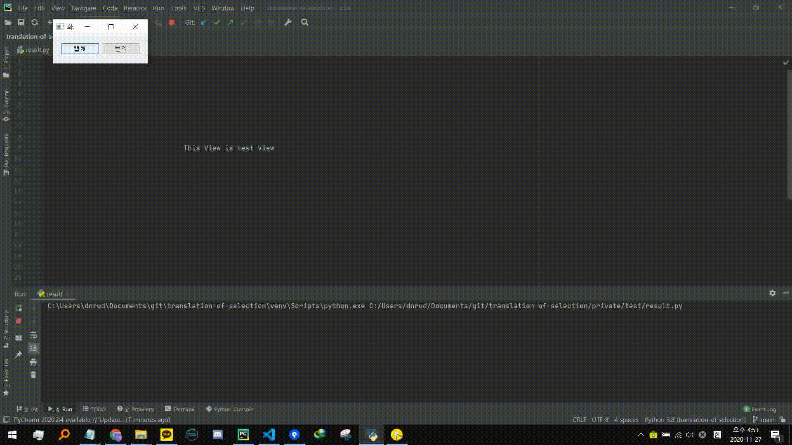

    

-----------------

[**Translation_OF_Selection**](https://github.com/dnrudzx/translation-of-selection)는 전체화면을 캡쳐 후 사각형 선택영역을 추가적으로 캡쳐해 번역하는 기능을 구현했습니다.  

이 프로젝트는 [**박우경**](https://dnrudzx.github.io/web/), [**조호현**](https://github.com/)에 의해 개발되었습니다.  

이 프로젝트는 **PYTHON**을 통해 작성되었고, **PYQT5**, **PIL**, **OPENCV**, **GCP-VISION**, **NAVER-PAPAGO API**라이브러리를 사용해 개발되었습니다.

## Contents
1. [결과](#결과)
2. [기능](#기능)
3. [사용법](#사용법)
4. [배포제약사항](#배포제약사항)

## 결과
### v1.0 캡쳐 후 번역

    
     
    PYPI메인 페이지에서 테스트

## 기능
- **주요 기능**:
    - **캡쳐 화면 내 선택영역 드로깅**:
        - 캡쳐 화면 내의 x,y좌표를 마우스 이벤트를 통해 감지해 사각형을 그리고 저장
    - **선택영역 OCR**:
        - GCP(Google Cloud Platform)의 Vision API를 활용
        - 이미지를 전송후 응답메시지 처리후 출력
    - **번역 기능**:
        - NAVER PAPAGO API 사용
        - 1차적인 목표로 영어를 한국어로 변환하는 것이 목적이기에 한국어 번역능력이 가장 뛰어난 PAPAGO API사용
        - 차후 언어에 대한 선택 구현시 googletrans 라이브러리 사용
- **입력 및 출력**:
    - **캡쳐버튼**:
        - 입력 : NONE
        - 출력 : 동일 디렉토리 내 capture.png 생성
    - **캡쳐화면 드래깅**:
        - 입력 : 드래그 좌표, capture.png
        - 출력 : 동일 디렉토리 내 select_area.png 생성
    - **번역버튼**:
        - 입력 : select_area.png, GCP-Vision API키, NAVER 개발자센터 Client-ID 및 Client-Secret 키
        - 출력 : 프로그램 실행창(ex.cmd or pycharm, etc)에 print형식으로 출력

## 사용법
각 기능별 사용법에 대해서는 [다음문서](https://github.com/)에서 표시하겠습니다.

## 배포제약사항
- **GCP-Vision** : 저희는 GCP의 무료 크레딧을 통해 개발하였고, 혹시 모를 키 노출에 의한 사고를 원하지 않습니다. 하여 키에대해 '[Service_Account_Key]'형태로 표시하였습니다.
- **NAVER 개발자센터** : 해당 사이트의 경우 API의 사용에 글자수 제한이 있고, 또 다른 특정 방법을 사용해 악용될 가능성에 대해 원천 차단을 하기 위해 Client id 및 secret에 대해 '[NAVER Client id],[NAVER Client Secret]'로 표기하였습니다.